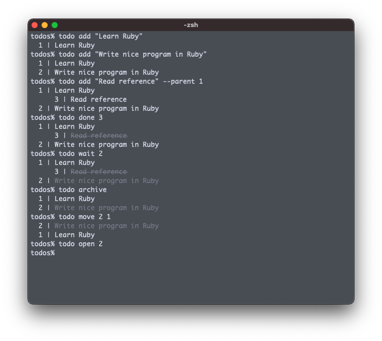

# todo

## Installation

### Homebrew

```
$ brew install naoty/misc/todo
```

### Rubygems

```
$ gem install todo --version "<version>" --source "https://rubygems.pkg.github.com/naoty"
```

## Usage


## Environment variables
* `TODOS_PATH`: The root path of TODO files (default: `$HOME/.todos`)

## Author

[naoty](https://github.com/naoty)
